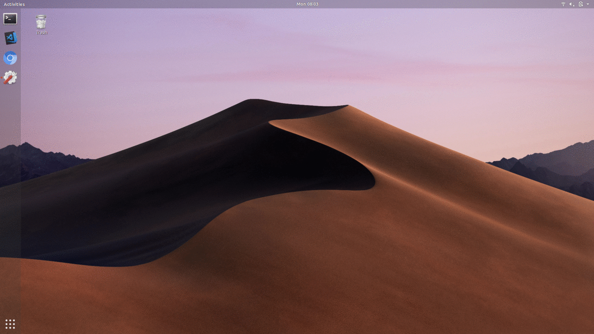

# dynpaper

Note the time!



## About  
This project has been inspired by MacOS Mojave's dynamic wallpaper. It has been built with modularity in mind making the addition of new wallpapers trivial. It has been tested on Ubuntu 18.04 with Gnome.


## How

The script uses the schema library to validate the configuration file, during the validation, the script checks if the files exist in the specified locations. This is done only __once__ at every initialization of the script, if a file does not exist during the initialization, the script will exit, raising an error. If a file is removed after the initialization, the outcome depends on the Window manager that's being used.

Then the script creates a list of files and the datetime until the wallpaper gets replaced by the next.

To set the wallpaper, the script uses part of [WeatherDesk](https://github.com/bharadwaj-raju/WeatherDesk) module, written by [Bharadwaj Raju](github.com/bharadwaj-raju) <bharadwaj.raju777@gmail.com>.

Through Bharadwaj's [desktop](/dynpaper/desktop.py) script, all of the following configurations are available:

### Linux

* AfterStep
* Awesome WM
* Blackbox
* Cinnamon
* Enlightenment
* Fluxbox
* Gnome 2
* Gnome 3
* i3
* IceWM
* JWM
* KDE
* LXDE
* LXQt
* Mate
* Openbox
* Pantheon
* Razor-Qt
* Trinity
* Unity
* Windowmaker
* XFCE


## Usage

1. Install through pip3.
    > At the moment, only `python ^3.6` is supported.  

    `pip3 install --user dynpaper`

2. Do one of the following:  
    *   Download one of the configuration files from [here](../sample_configs) to a folder  
    *   Do `dynpaper --init` or `dynpaper -i`.
        > A configuration file has been created in `~$HOME/.config/dynpaper/config`

3. Modify the configuration file so it fits your usecase.

4. Run dynpaper:  
    `dynpaper -f <path to config> &`
    > If you want dynpaper to run in the beginning of the session, simply add the line above to your `.profile` or `.zsh_profile`.

### Configuration

Dynpaper reads a yaml formatted list. Each element in the list is a dictionary/mapping.  
The dictionary contains __2__ keys, `time` and `files`. The key `time` indicates the time this list of papers starts to show.  
The value for `time` is in this format: `HH:mm`. The value of `files` is a list of strings or dictionary objects.  
The string object is a __direct__ path to file.  
The dictionary is in this form:
```Yaml
    - template:
        path: ~/Pictures/Wallpapers/wallpaper{}.jpeg
        range: X, Y
```
Range indicates the numbers that will replace `{}` in the string, the numbers are in `[X,Y)`. After processing, the template with `range:13, 16 ` gets replaced by a generated list of files.  
In this case, the template is replaced by:
```Yaml
    ~/Pictures/Wallpapers/wallpaper13.jpeg
    ~/Pictures/Wallpapers/wallpaper14.jpeg
    ~/Pictures/Wallpapers/wallpaper15.jpeg
```
The generated files start from first element and go up to the last, excluding the last.  


## Constributing


### Bugs:

If you have encountered a bug, please write an issue to report it.  
The issue should include your configuration file and the error 
you have encountered or the expected behavior.

### Feature requests:

Simply open an issue starting with `[FEATURE]` and explain the feature you'd like to see.

### Feature implementations:

Thank you for wanting to help in the development of dynpaper. If you 'd like to implement a feature 
but don't have anything in your mind, feel free to checkout `projects` tab. If you have a feature in mind and
you'd like to implement it, please open an issue explaining the feature and we will discuss it. If I believe
the feature is unnecessary I will probably refrain from adding it even if you've made a pull request so please
write an issue so you won't waste your time.

### Forking

If you dislike the direction the project is going, just fork and move on, it's BSD licensed afterall.

## Acknowledgements

Acknowledging Apple for the idea for time based wallpapers.

